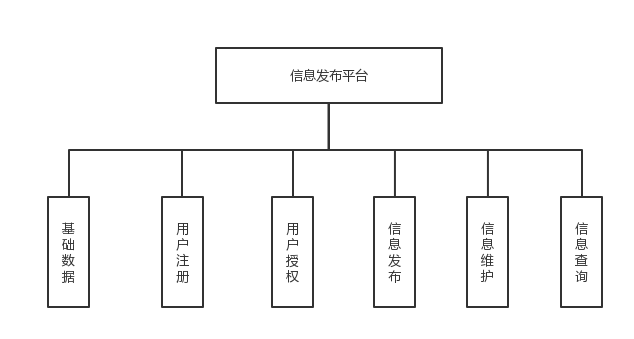
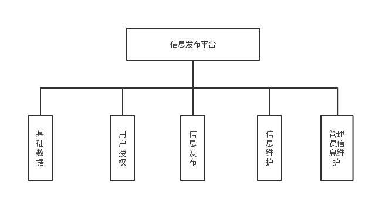

# Info-publish
## 系统概述
一个简单的J2EE项目,信息发布系统的复现
主要内容包括用户的注册,信息类别的管理,信息的发布和信息的浏览,首先注册用户,然后对用户进行授权,授权了的用户可以发布,浏览信息,普通用户不用授权即可以浏览信息.通过对该系统进行初步的分析和总结,得出系统需求如下:
- 系统可以运行在Windows操作系统平台上,并通过友好的用户界面进行管理
- 系统用户类型为普通用户,VIP用户和管理员
- 普通用户可以直接浏览信息
- 管理可以对一些基础的数据及信息进行管理和维护
- 普通用户需要注册
- 可以给VIP用户赋予一定的权限

不同的用户可以通过系统进行不同的操作.每一操作都是一个功能的体现,本项目使用了MyEclipse,Ant,Tomcat及Xammp等开源开发工具
- tomcat安装配置参考[tomcat-guide](http://blog.topspeedsnail.com/archives/4551)
## 需求分析
### 系统功能模块划分
通过前面的分析已经明确系统共有如下用户,即普通用户,VIP用户及管理员.普通用户只能浏览部分信息,而VIP用户通过管理员授权可以有更多的功能,同时对本系统进行分析后得出如下图所示的功能模块分解图. 

### 系统流程分析
本系统中的用户是管理员和普通用户以及VIP用户,根据以上的模块划分和功能分析可知,该系统的主要流程如下:
- 管理员登陆后,对本信息平台所发布的信息进行各种操作
- VIP用户可以对部分模块进行操作
- 普通用户只能查询/查看一些公共信息

下图描述的是管理员的操作权限:管理员登录后以列表的形式查看所有信息,如信息类型,用户基本资料,授权管理模块和管理员的资料,然后对相应信息做新增,修改,删除等操作,另外还可以发布信息,维护信息等.

### 系统设计
通过对前面所述的业务需求与系统流程进行分析,可以使用UML进行建模.通过数据库设计工具对数据库物理结构进行分析与设计后得出以下表
- 用户表(user):用于存放用户的基本资料 

|序号|字段|含义|类型|
|:---|:---|:---|:---|
|1|name|登录名|Varchar|
|2|password|密码|Varchar|
- 信息类型表(newsType):用于存放要发布的信息类型,作为基础数据表

|序号|字段|含义|类型|
|:---|:---|:---|:---|
|1|id|信息类型id|Ingteger|
|2|type||信息类型名称|Varchar|
- 信息表(news):用于存放要发布的信息或其他信息

|序号|字段|含义|类型|
|:---|:---|:---|:---|
|1|id|信息编号id|Ingteger|
|2|type|信息类型名称|Varchar|
|3|title|标题|Varchar|
|4|issuedate|发布日期|Date|
|5|issueuser|发布人|Varchar|
|6|newstype|信息发布类型|Varchar|
|7|content|内容|Varchar|
- 用户权限表(userAuthor):用于存放管理员授权的用户权限资料

|序号|字段|含义|类型|
|:---|:---|:---|:---|
|1|username|用户名|Varchar|
|2|power|权限串|Varchar|
